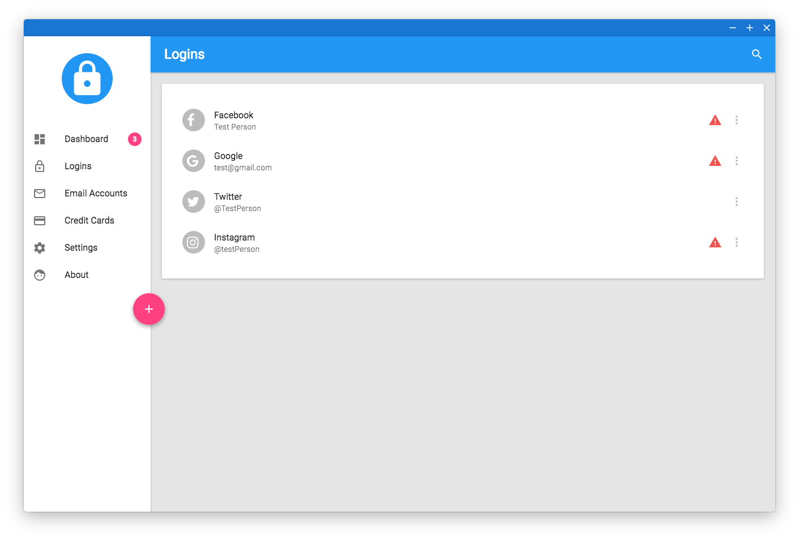

# Passwordmanager
This is an offline password-manager using AES-256, that allows store your passwords safely on your machine, while still being able to access them using your master-password. The Passwordmanager is easy to use, and looks amazing thanks to Google's Material Design. It is coded entirely in JavaScript using [Electron](https://electron.atom.io/), [React](https://facebook.github.io/react/), [Redux](http://redux.js.org/) and many other new and exciting web-technologies.



## Getting started

The simplest way to get the Passwordmanager up and running on your machine is to install one of the precompiled binaries. Currently, only Linux and OS X binaries are available, although this may eventually change in the future.

* [Linux x86]()
* [Mac OS X]()

*Note: In order to ensure the software runs correctly, be sure to install the software in your operating-system's default location.*

### Build it yourself
If your system is not listed above, you have the option to build the software yourself, by downloading the repository and issuing the following commands in the terminal:

```
cd /path/to/directory/
npm install
npm run release
```

You can then find the compiled file inside the `/dist/` folder inside the root directory.

## Contribute
If you like the project and want to contribute, I highly encourage you to do so. In order to start developing, it is of importance to understand the structure of the [electron-boilerplate](https://github.com/szwacz/electron-boilerplate).

The `/app/` folder is reserved for static files such as `app/index.html`, images etc. **However**, as most of your files will need preprocessing (Babel, etc.) you probably spend most of your time in the `/src/` folder. The two most important files of the application are `src/app.js` - it is the starting point of the application and holds both the redux store and the main react component while the file
`src/background.js` handles the electron-side of things.

## Testing

Once you've edited to the source code, you probably want to test those changes. You do this by issuing the following commands:

```
cd /path/to/directory/
npm start
```

After that, you all of your changes to the source-code are made visible
in real-time (after you've saved them of course) - you don't have to quit or recompile the software manually, everything is taken care for you!

## License
This project is licensed under the MIT license - see the [LICENSE.md](LICENSE.md) file for details

## Acknowledgements
The graphics featured in the getting-started
screen were designed by [Icon Pond](http://www.flaticon.com/authors/popcorns-arts) from [Flaticon](http://www.flaticon.com/). Be sure to check out their awesome work!
